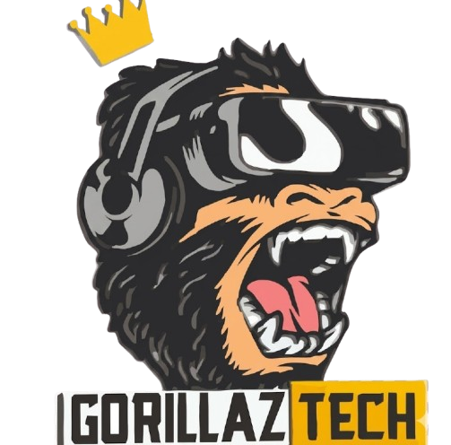

# 🦍 GorillazTech

Site institucional da **GorillazTech** - Assistência técnica especializada em manutenção de celulares, computadores e venda de acessórios.



## 📋 Sobre o Projeto

Landing page moderna e responsiva desenvolvida para a GorillazTech, uma loja de assistência técnica localizada no Rio de Janeiro com duas unidades (Pilares e Engenho da Rainha).

### ✨ Funcionalidades

- **Hero Section** animada com partículas e efeitos visuais
- **Menu Hamburger** criativo em formato de gorila (mobile)
- **Carrossel infinito** de produtos com drag/touch support
- **Chat WhatsApp** interativo com seleção de serviço e loja
- **Mapa interativo** com Leaflet mostrando as duas lojas
- **Formulário de contato** com validação
- **Design responsivo** (mobile-first)
- **Animações** suaves ao scroll

## 🛠️ Tecnologias

- HTML5
- CSS3 (Custom Properties, Flexbox, Grid, Animations)
- JavaScript (Vanilla)
- [Leaflet](https://leafletjs.com/) - Mapas interativos
- [Font Awesome](https://fontawesome.com/) - Ícones
- [Google Fonts](https://fonts.google.com/) - Tipografia (Poppins)

## 📁 Estrutura do Projeto

```
GorillazTech/
├── index.html          # Página principal
├── styles.css          # Estilos globais
├── hero.css            # Estilos da seção hero
├── script.js           # JavaScript principal
├── README.md           # Documentação
└── assets/
    └── images/
        └── logo/
            └── logotipo.png
```

## 🚀 Como Executar

1. Clone o repositório:
```bash
git clone https://github.com/seu-usuario/gorillaztech.git
```

2. Abra o arquivo `index.html` no navegador ou use um servidor local:
```bash
# Com Python
python -m http.server 8000

# Com Node.js (npx)
npx serve
```

3. Acesse `http://localhost:8000`

## 📱 Responsividade

O site é totalmente responsivo, adaptando-se a:
- 📱 Mobile (< 480px)
- 📱 Mobile Large (480px - 768px)
- 💻 Tablet (768px - 1024px)
- 🖥️ Desktop (1024px - 1200px)
- 🖥️ Desktop Large (> 1200px)

## 🎨 Paleta de Cores

| Cor | Hex | Uso |
|-----|-----|-----|
| Amarelo/Dourado | `#ffc107` | Cor primária, destaques |
| Preto | `#212121` | Cor secundária, textos |
| Laranja | `#ff6b35` | Cor de acento |
| Verde WhatsApp | `#25d366` | Botões WhatsApp |

## 📍 Lojas

### Loja 1 - Pilares
- **Endereço:** Rua Soares Meireles, 176 - Pilares, RJ
- **WhatsApp:** (21) 96687-4514

### Loja 2 - Engenho da Rainha
- **Endereço:** Rua Carlos Gonçalves Penna, 192 - Engenho da Rainha, RJ
- **WhatsApp:** (21) 99010-6402

## 📄 Licença

Este projeto é proprietário da GorillazTech. Todos os direitos reservados.

## 👨‍💻 Desenvolvido por

[kryvex.dev](https://kryvex.dev)

---

© 2024 GorillazTech - Todos os direitos reservados
